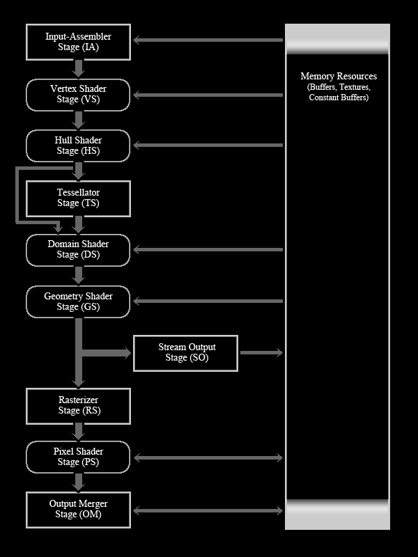

# DirectX 11

参考链接:

- https://www.braynzarsoft.net/viewtutorial/q16390-braynzar-soft-directx-11-tutorials

## Pragrammable Graphics Rendering Pipeline

参考链接

- https://docs.microsoft.com/en-us/windows/desktop/direct3d11/overviews-direct3d-11-graphics-pipeline
- https://www.braynzarsoft.net/viewtutorial/q16390-4-begin-drawing

The rendering pipeline is the set of steps direct3d uses to create a 2d image based on what the virtual camera sees. It consists of the 7 Stages used in Direct3D 10, along with 3 new stages accompanying Direct3D 11, which are as follows:

1. Input Assembler (IA) Stage
2. Vertex Shader (VS) Stage
3. Hull Shader (HS) Stage
4. Tesselator Shader (TS) Stage
5. Domain Shader (DS) Stage
6. Geometry Shader (GS) Stage
7. Stream Output (SO) Stage
8. Rasterizer (RS) Stage
9. Pixel Shader (PS) Stage
10. Output Merger (OM) Stage



## World, View and Local Spaces

参考链接

- https://www.braynzarsoft.net/viewtutorial/q16390-8-world-view-and-local-spaces-static-camera
- https://docs.microsoft.com/en-us/windows/desktop/direct3d11/overviews-direct3d-11-resources-buffers-intro

### Constant Buffers

A constant buffer is basically a structure in an effect file which holds variables we are able to update from our game code. We can create a constant buffer using the cbuffer type. An example, and the one we will use looks like this:

```c++
cbuffer cbPerObject
{
    float4x4 WVP;
};
```

Constant buffers should be seperated by how often they are updated. This way we can call them as least as possible since it takes processing time to do it. Examples of different frequencies we call a constant buffer are:

1. per scene (call the buffer only once per scene, such as lighting that does not change throughout the scene)
2. per frame (such as lighting that does change position or something every frame, like the sun moving across the sky)
3. per object (Like what we will do. We update the WVP per object, since each object has a different World space, or position, rotation, or scaling)


